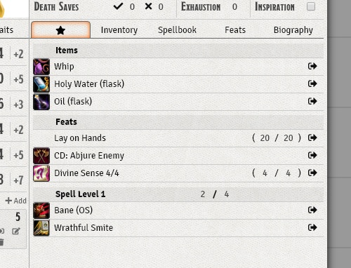

# Favourite Item Tab

Adds a Favourite tab to display a customized list of items, feats and spells. Usable with the default dnd5e Character sheet.
You can add any item from the inventory, spellbook or feature section of the Charactersheet. This module also gives access to item charges. You can add these to any item on the favourite list or remove them by changing the maximum to 0. This uses the same data that is used by Moerill#7205's adnd5e module, since this data is not supported by default.

> This version only works for Foundry v0.4.0 and up. To use the previous version please visit https://github.com/syl3r86/favtab/tree/pre-0.4.0

## Installation
1. Copy this link and use it in Foundrys Module Manager to install the Module

    > https://raw.githubusercontent.com/syl3r86/favtab/master/module.json
    
2. Enable the Module in your Worlds Module Settings

Once you marked at least one item as favourite, the tab will show up and offer the new possibilitys.
If you have any suggestions or problems concerning this module, feel free to contact me in discord (Felix#6196) or per email (syl3r31@gmail.com).

## Contribution
If you feel like supporting my work, feel free to leave a tip at my paypal felix.mueller.86@web.de

## License
 Favourite Item Tab - a module for Foundry VTT - by <a xmlns:cc="http://creativecommons.org/ns#" href="https://github.com/syl3r86?tab=repositories" property="cc:attributionName" rel="cc:attributionURL">Felix Müller</a> is licensed under a <a rel="license" href="http://creativecommons.org/licenses/by/4.0/">Creative Commons Attribution 4.0 International License</a>.

This work is licensed under Foundry Virtual Tabletop [EULA - Limited License Agreement for module development v 0.1.6](http://foundryvtt.com/pages/license.html).
